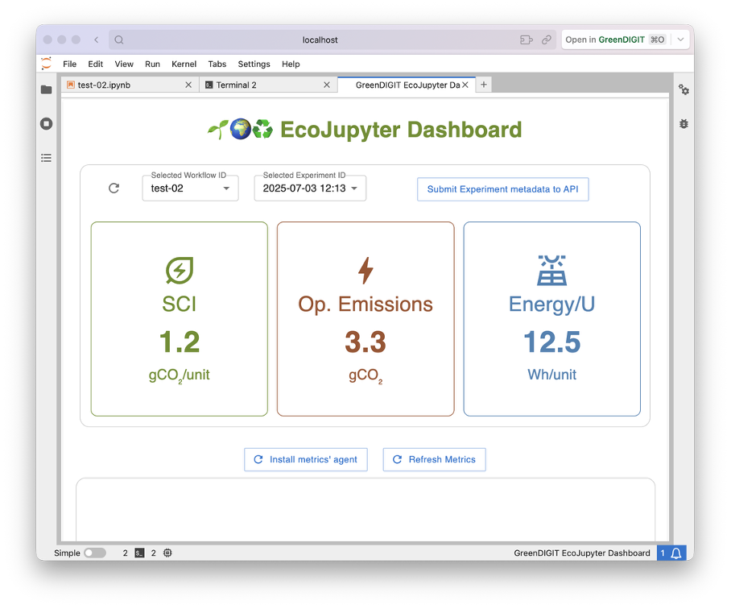

# 🌱🌍♻️ EcoJupyter (a [GreenDIGIT](https://greendigit-project.eu/) project)

`EcoJupyter` is an platform-agnostic sustainability assessment tool for AI infrastructures. The current version is focused on Jupyter Notebook.

This code is open-source, so feel free to copy/paste it into your machine. Please, keep in mind that this is still WIP: it works best with [L1EcoVRE](https://github.com/g-uva/L1EcoVRE) infrastructure configuration and scripts. _For more info please contact the main contributor._

## 👀 Sneak peek



## Installation


```sh
pip install --upgrade ecojupyter
```

## Development setup

Create and activate a local Python environment:

```sh
python -m venv .venv
source .venv/bin/activate
```

Install JupyterLab and this extension in editable mode:

```sh
python -m pip install "jupyterlab>=4.0.0,<5"
SKIP_JUPYTER_BUILDER=1 python -m pip install -e .
yarn install

# Run everytime some ts file in src/ changes.
yarn build:lib --skipLibCheck
PATH=.venv/bin:$PATH jupyter labextension build --development True .

PATH=.venv/bin:$PATH jupyter labextension develop . --overwrite
```

Install the frontend dependencies and watch the extension sources:

```sh
yarn install
yarn watch
```

In another terminal, activate the same environment and start JupyterLab:

```sh
source .venv/bin/activate
jupyter lab
```

Commands for a hard refresh during development:

```bash
yarn build:lib --skipLibCheck
PATH=.venv/bin:$PATH jupyter labextension build --development True .
PATH=.venv/bin:$PATH jupyter labextension develop . --overwrite
```
