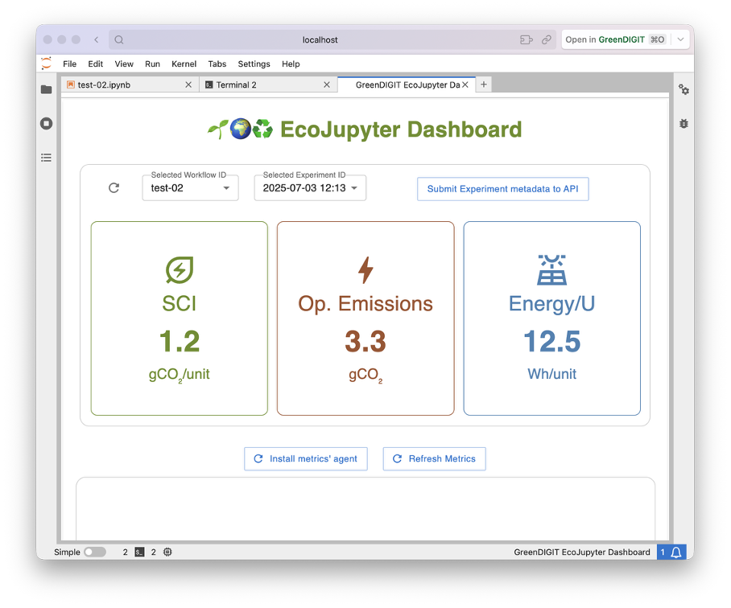

# 🌱🌍♻️ Jupyter VRE Workflow (a [GreenDIGIT](https://greendigit-project.eu/) project)

Jupyter VRE Workflow is a platform-agnostic sustainability assessment tool for AI infrastructures. The current version is focused on Jupyter Notebook.

This tool was developed for the GreenDIGIT EU Project, with the main goal of providing a platform agnostic and easily-pluggable sustainability and reproducibility tool.

This code is open-source, so feel free to copy/paste it into your machine. Please, keep in mind that this is still WIP: it works best with [L1EcoVRE](https://github.com/g-uva/L1EcoVRE) infrastructure configuration and scripts. _For more info please contact the main contributor._

## Main features

- Run an entire notebook as a tracked experiment in a fresh kernel.
- Read real RAPL energy, current power and average power, with explicit unavailable status when hardware counters cannot be read.
- Save input/output notebooks, labelled raw metrics and precise run metadata in one experiment directory.
- Experimental FDMI publishing UI; external delivery is not yet verified.

Use **Run notebook as experiment** in the extension or command palette. Ordinary JupyterLab **Run All** does not create a tracked run. See the [experiment workflow and artifact layout](doc/docs/modules/reproducibility.md) and [hardware telemetry requirements](doc/docs/modules/telemetry.md).

It works best with [L1EcoVRE](https://github.com/g-uva/L1EcoVRE) infrastructure configuration and scripts. _For more info please contact the main contributor._



## Installation
In order to install the tool as an extension in Jupyter Notebook or Lab (not in development), simply install the tool in your Python environment where Jupyter is running.
```sh
pip install --upgrade ecojupyter
```

## Development & Extension Framework

This repository was initially scaffolded using the official [JupyterLab Extension Tutorial](https://jupyterlab.readthedocs.io/en/stable/extension/extension_tutorial.html).  
As a result, the extension supports a development mode with **live reloading**, allowing for real-time updates to the UI as you modify TypeScript/React components.

To launch the development environment (as per the tutorial), run:

```bash
./scripts/start-jupyterlab-dev.sh
```

This will start JupyterLab in development mode, ideal for iterating on the UI and debugging extension logic interactively.

Python Package & Deployment
The Python package is published on PyPI and can be built locally via:

```bash
./scripts/build-rel-package.sh -m "Your release message"
```
This script automatically bumps the version, commits, tags, builds, and uploads to PyPI.

Before running it, create a `.env` file in the repo root with your PyPI token:
```
PYPI_TOKEN="pypi-your-token-here"
```
You can generate a token at [pypi.org/manage/account/token](https://pypi.org/manage/account/token/).

#### Future Improvements
- Version-based deployment: easily extendable via GitHub releases or semantic versioning.
- CI/CD integration: GitHub Actions workflows are already present and can be extended for linting, testing, and publishing.
- Custom builds: additional scripts like `install-conda.sh` and `uninstall-conda.sh` support environment setup and teardown, aiding reproducibility.

## Project structure

### API definitions
Tracked runs use the authenticated Jupyter server REST endpoint `api/ecojupyter/experiments` to create, inspect and cancel experiments. `ecojupyter/experiments.py` owns execution and persistence; `ecojupyter/telemetry.py` reads the counters. The frontend client is `src/api/experiments.ts`. Tracking no longer injects bookkeeping code into the interactive notebook kernel.

Run the backend tests with `python -m unittest discover -s tests -v` in an environment with the project dependencies and `ipykernel` installed.

### Folder Structure
```txt
Jupyter VRE Workflow/
├── .copier-answers.yml
├── .gitignore
├── .prettierignore
├── .yarnrc.yml
├── CHANGELOG.md
├── LICENSE
├── README.md
├── RELEASE.md
├── Untitled.ipynb
├── install.json
├── package.json
├── pyproject.toml
├── setup.py
├── tsconfig.json
├── yarn.lock
├── .github
│   └── workflows
│       ├── binder-on-pr.yml
│       ├── build.yml
│       ├── check-release.yml
│       ├── enforce-label.yml
│       ├── prep-release.yml
│       ├── publish-release.yml
│       └── update-integration-tests.yml
├── assets
│   └── EcoJupyter_screenshot.png
├── ecojupyter
│   └── __init__.py
└── scripts
│   ├── add-catalogue-entry.sh
│   ├── build-rel-package.sh
│   ├── install-conda.sh
│   ├── start-jupyterlab-dev.sh
│   └── uninstall-conda.sh
└── src
    ├── api
    │   ├── ApiTemp.ts
    │   ├── api-temp-openapi.yml
    │   ├── apiScripts.ts
    │   ├── getCarbonIntensityData.ts
    │   ├── getScaphData.ts
    │   ├── handleNotebookContents.ts
    │   └── monitorCellExecutions.ts
    ├── components
    │   ├── FetchMetricsComponents.tsx
    │   ├── KPIComponent.tsx
    │   ├── KpiValue.tsx
    │   ├── MetricSelector.tsx
    │   └── ...
    ├── dialog
    │   └── CreateChartDialog.tsx
    ├── helpers
    │   ├── constants.ts
    │   ├── types.ts
    │   └── utils.ts
    ├── index.ts
    └── widget.tsx
```

## Development setup

Create and activate a local Python environment:

```sh
python -m venv .venv
source .venv/bin/activate
```

Install JupyterLab and this extension in editable mode:

```sh
python -m pip install "jupyterlab>=4.0.0,<5"
SKIP_JUPYTER_BUILDER=1 python -m pip install -e .
yarn install

# Run everytime some ts file in src/ changes.
yarn build:lib --skipLibCheck
PATH=.venv/bin:$PATH jupyter labextension build --development True .

PATH=.venv/bin:$PATH jupyter labextension develop . --overwrite
```

Install the frontend dependencies and watch the extension sources:

```sh
yarn install
yarn watch
```

In another terminal, activate the same environment and start JupyterLab:

```sh
source .venv/bin/activate
jupyter lab
```

Commands for a hard refresh during development:

```bash
yarn build:lib --skipLibCheck
PATH=.venv/bin:$PATH jupyter labextension build --development True .
PATH=.venv/bin:$PATH jupyter labextension develop . --overwrite
```
